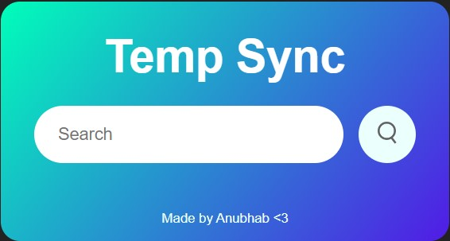
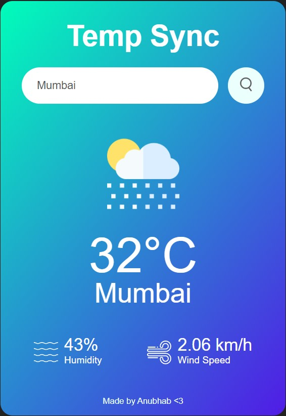

# TempSync Weather App

A sleek and simple weather application built using HTML, CSS, and Vanilla JavaScript.




## Table of Contents

- [Overview](#overview)
- [Features](#features)
- [Installation](#installation)
- [Usage](#usage)
- [Weather Details](#weather-details)
- [Contributing](#contributing)
- [License](#license)

## Overview

TempSync is a user-friendly weather app that provides real-time weather updates. With a clean and intuitive interface, users can quickly check the current temperature and weather conditions.

## Features

- View current temperature and weather conditions
- Intuitive and responsive design
- Search for weather information in different locations
- Seamless integration with external weather APIs


## Usage
- **Clone the repository:**

   ```bash
   git clone https://github.com/your-username/TempSync.git

- **Open the App:**
  - Open the `index.html` file in your web browser.

- **Upon Opening:**
  - The current temperature and weather conditions for your location are displayed.

- **Search Functionality:**
  - Use the search functionality to check the weather in different locations.


## Weather Details

- The app provides essential weather details such as:
  - Temperature
  - Humidity
  - Wind speed

- Icons and visual elements make it easy to interpret weather conditions at a glance.


## Contributing

Contributions are welcome! If you'd like to contribute to TempSync, please follow these steps:

1. Fork the project.
2. Create a new branch (`git checkout -b feature/new-feature`).
3. Commit your changes (`git commit -am 'Add new feature'`).
4. Push to the branch (`git push origin feature/new-feature`).
5. Open a pull request.


## License

This project is licensed under the MIT License.

---

**Stay Updated with TempSync and Weather the Day Effectively!**
